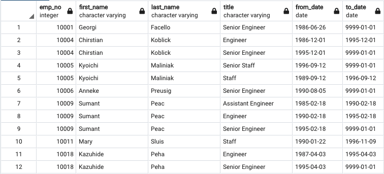
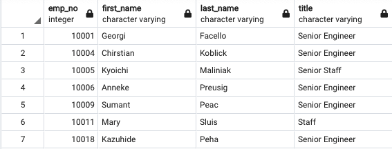
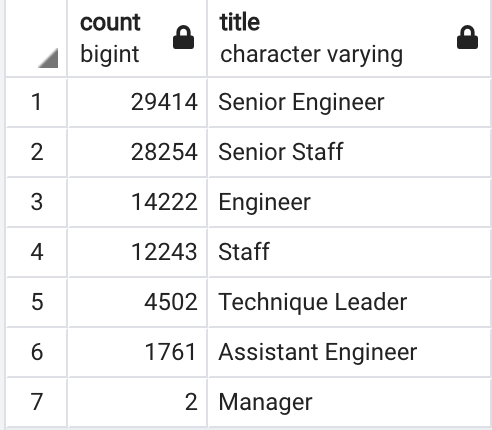
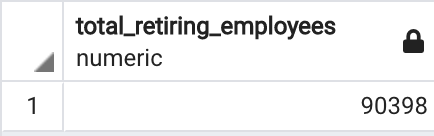
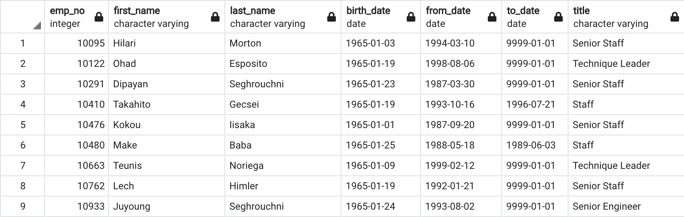
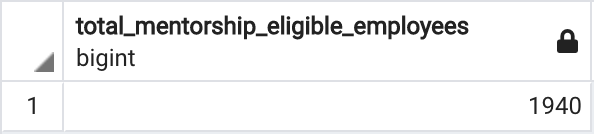

# Pewlett-Hackard-Analysis

## Overview
Based on provided csv files, each containing different information with connecting primary keys, analysis was done by joining different tables together to create a new table with the data that is needed. 

For the first table, number of retiring employees per title was determined and identified by joining the Employees and the Titles tables together on the primary key.

For the second table, the employees who are eligible for the mentorship program were determined and identified by joining the Employees, Department Employees, and Titles tables on the primary key where a certain date range was set in place for the employees' birth dates.

## Results
- First table "retirement_titles" was created by joining the Employees and the Titles tables together. Because some employees were promoted during their employment period, there are some duplicate names with different titles as shown on below image.
### 
- From the retirement_titles table, DISTINCT ON was used to remove duplicates which was ordered by employee numbers in ascending order. A new table "unique_titles" was created to show the most recent titles for each employees as shown on below image.
### 
- On the third table that was created, "retiring_titles", each unique titles were counted to show the total number of each employees that will be retiring for each titles. Total number of employees retiring soon would be 90,398.
### 
### 
- The last table created "menorship_eligibility" shows the total number of retiring employees who are eligible to participate in the mentorship program as a part-timers. Three tables which are Employees, Department Employees, and Titles were joined together with the birth date filtered with a certain date range. Total number of retiring employeese who are eligible to join the mentorship program are 1,940.
### 
### 

## Summary
- How many roles will need to be filled as the "silver tsunami" begins to make an impact?
  - As the silver tsunami begins to make an impact, about 90,000 roles would need to be filled.
- Are there enough qualified, retirement-ready employees in the departments to mentor the next generation of Pewlett Hackard employees?
  - There are total of 1,940 retirement-ready employees in the departments to mentor the next generation of Pewlett Hackard employees.
- Two queries that can be used for more insight into the upcoming silver tsunami would be as shown below. Below two queries will show the totla number of employees that are retiring and the retirement-ready employees that qualify to mentor the next generation.
### count of total number of retiring employees
    select sum(count) as Total_Retiring_Employees
    from retiring_titles;
    
### count of total number of mentorship eligibility employees who are retirement-ready
    select count(emp_no) as Total_Mentorship_Eligible_Employees
    from mentorship_eligibility;
